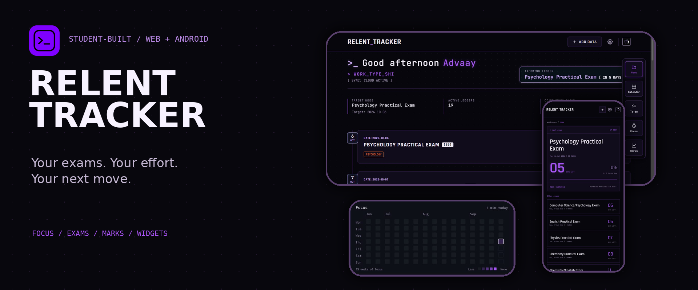
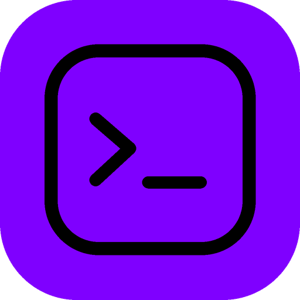
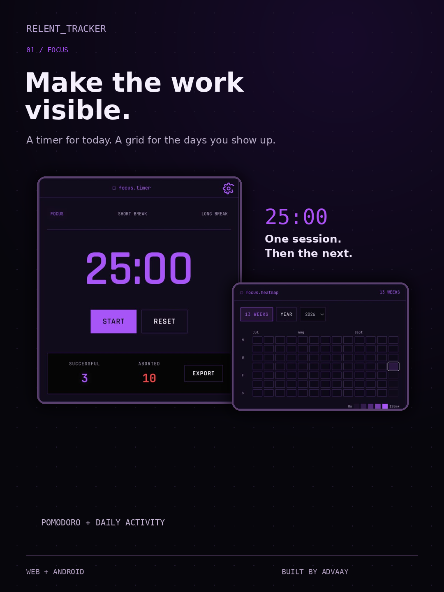
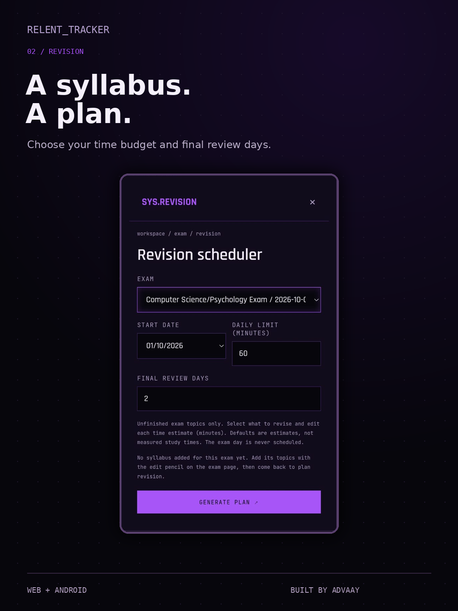
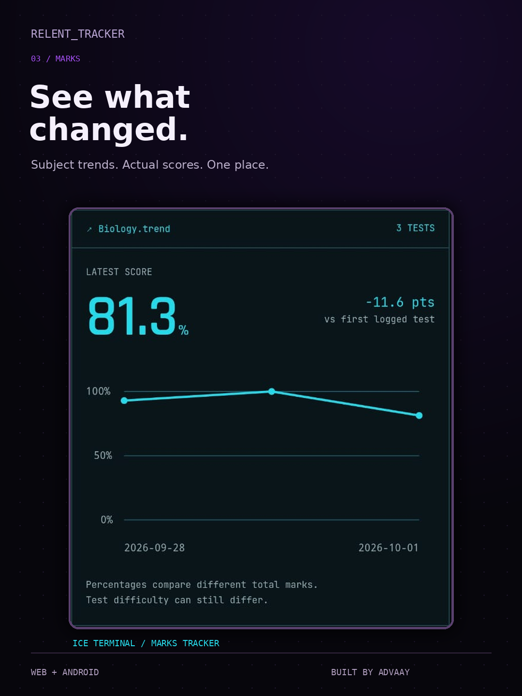
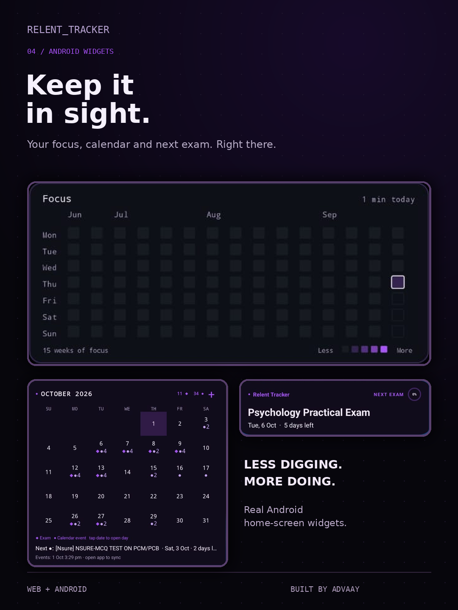
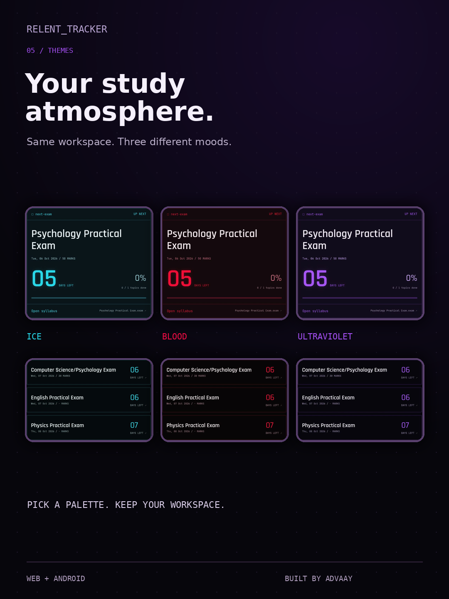
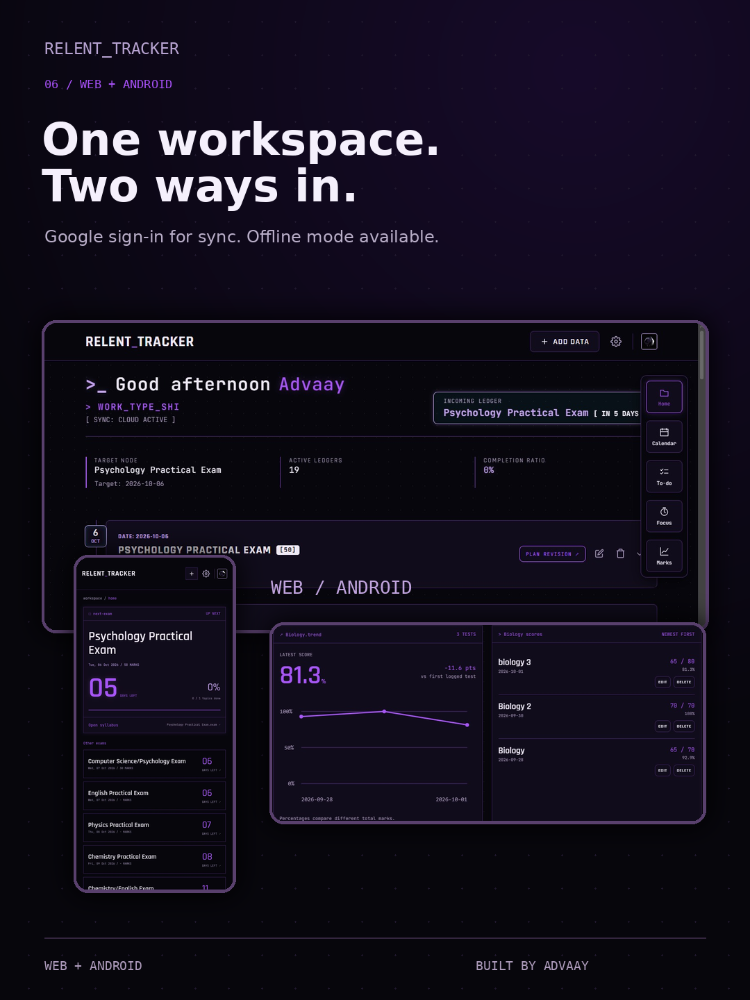

<p align="center"></p>

<div align="center">



# RELENT TRACKER

### Your exams. Your effort. Your next move.

A study workspace built by a student, for the days when everything is due at once.

**Plan the syllabus. Put in the focus sessions. See what changes.**

[Open the dashboard](https://study-dashboard-rose-psi.vercel.app) · [Get the Android app](https://github.com/notdropkun/Relent-Tracker/releases) · [See what's new](https://github.com/notdropkun/Relent-Tracker/releases/tag/v1.2.0)


<p>
<a href="https://study-dashboard-rose-psi.vercel.app"></a>
<a href="https://github.com/notdropkun/Relent-Tracker/releases"></a>
</p>

**Exam countdowns · Focus heatmap · Revision plans · Marks · Android widgets**

</div>

---

## ⚡ Built around studying, not just checking boxes

Relent Tracker started as my own study dashboard. I'm a Class 12 student building it around board prep and entrance-exam revision, then making it useful for other students too.

The idea is simple: keep the exam, its syllabus, today's work and your progress in the same place. The web app and Android app share the same workspace, with Google sign-in for sync or an offline mode when you don't want an account.

[Features](#-one-workspace-from-plan-to-progress) · [Screenshots](#-inside-the-app) · [Android](#-take-it-to-your-home-screen) · [Data](#-your-data-without-the-small-print) · [Source](#-under-the-hood)

## ✨ One workspace, from plan to progress

### 📚 Know what's coming

- Add exams with dates, marks and a live countdown.
- Break the syllabus into subjects, categories and topics.
- Tick off topics and track completion without losing sight of the deadline.
- Keep exams, calendar events and everyday to-dos together.

### 🗓️ Turn the syllabus into a plan

The revision scheduler works backwards from an upcoming exam with an exact date.

Choose unfinished topics, estimate the time they need, set a daily study limit and reserve final review days. Preview the dated plan before saving it to To-do. If the work won't fit, the scheduler tells you instead of pretending it will.

Completing a revision task doesn't silently tick off your syllabus. Those are separate decisions.

### ⏱️ Make the work visible

- Run Pomodoro focus sessions and track completed sessions.
- See day-by-day activity in a GitHub-style focus heatmap.
- Switch between a recent 13-week view and a year view; tap a day for session details.
- Put the focus grid on your Android home screen and tap it to open Focus.

The heatmap starts recording daily activity with completed sessions. It doesn't invent a history from old totals.

### 📈 Track marks, not guesses

Log a school exam, mock or other test with its subject, date and score. See subject-wise trends, percentages and the underlying score history. Add a note or link a result to an exam.

Scores stay separate from syllabus completion. Percentages help compare tests with different totals, but different test difficulty still matters.

### 🎨 Pick your atmosphere

**Ice terminal. Blood neon. Ultraviolet.** Plus more themes and hidden character-inspired extras.

The dashboard's terminal-style details, line icons, voice/audio extras and Android widget themes make it feel like your own workspace.

## 📸 Inside the app

Real captures from the web, Android app and home-screen widgets. No invented screens.

<table>
<tr>
<td width="33%"></td>
<td width="33%"></td>
<td width="33%"></td>
</tr>
<tr>
<td></td>
<td></td>
<td></td>
</tr>
</table>

## 📱 Take it to your home screen

The Android app, **RTracker**, wraps the web dashboard in a native Kotlin shell and adds home-screen widgets and an in-app update check.

| Widget | What it puts in reach |
| --- | --- |
| Exam | Your next exam, with syllabus details in the larger layout |
| Calendar | A month view with exam and event markers |
| Focus | A 15-week activity grid, theme sync and a shortcut into Focus |

Log in once in the app to connect your widgets to your account. Use the same Google account on the web and Android for your synced workspace.

### Download and install

1. Open [GitHub Releases](https://github.com/notdropkun/Relent-Tracker/releases).
2. Download the `RTracker` APK from the release you want.
3. Open the file on Android and allow installation from that source if Android asks.

**Current featured release:** [v1.2.0](https://github.com/notdropkun/Relent-Tracker/releases/tag/v1.2.0), with the new focus widget.

**Android 7.0 or newer.** Keep Android System WebView updated.

### Updates, without starting over

Use **Settings → Android App → Check for updates** inside RTracker. The in-app updater checks GitHub releases. Website features are deployed separately, so not every web change needs a new APK.

**Install new APKs over the existing app. Don't uninstall first:** uninstalling can remove local app and widget data.

Prefer an external update manager? Add `https://github.com/notdropkun/Relent-Tracker` in [Obtainium](https://github.com/ImranR98/Obtainium).

<details>
<summary>🔏 Verify an APK</summary>

Release notes can include the APK's SHA-256 hash. Compare the downloaded file with the hash for that exact release.

The currently documented release signing certificate SHA-256 fingerprint is:

```text
CF:00:EA:AB:E7:AA:7F:F7:CE:9A:FB:3A:EA:D8:74:0D:83:9B:74:8A:D2:39:51:4A:89:B9:06:E4:83:08:67:53
```

</details>

## 🌐 Or just open the website

[Launch Relent Tracker](https://study-dashboard-rose-psi.vercel.app).

The web app includes a PWA manifest and service worker for installation. Online features such as sign-in, cloud sync and fetching updates still need a connection.

## 🔐 Your data, without the small print

- **Offline mode:** your workspace is stored on your device. Clearing site/app storage or uninstalling can remove local data.
- **Google sign-in:** Firebase Authentication handles login; Firestore stores synced study data for use across devices.
- **Marks:** saved locally and synced to your signed-in account; the marks view is excluded from observer mode.
- **Observer links:** let someone view a read-only snapshot. Share one only with people you want to see that information.
- **Widgets:** exam details are mirrored into a separate Firestore widget record. Don't treat the widget mirror as a place for confidential information.

This isn't an account-free, cloud-free app when you choose sync. Offline mode and cloud sync are different choices.

## 🛠️ Under the hood

| Layer | Built with |
| --- | --- |
| Web interface | HTML, CSS and JavaScript |
| Sign-in and sync | Firebase Authentication and Firestore |
| Installable web app | Web app manifest and service worker |
| Hosting | Vercel |
| Android shell and widgets | Kotlin / Android |
| APK distribution and update source | GitHub Releases |

This repository contains the **website source and Android release downloads**. The native Android source isn't in this repository at present.

```text
Relent-Tracker/
├── index.html        # Dashboard, styles and app logic
├── manifest.json     # PWA configuration
├── sw.js             # Service worker
├── assets/           # Audio, icons and other app assets
├── docs/screenshots/ # README hero, logo and promo posters
├── .well-known/      # App/site association files
├── SECURITY.md
└── LICENSE
```

The web project has no bundled frontend build step. To explore a local copy, serve the repository with a local HTTP server. Cloud sign-in and sync need your own Firebase setup and authorized domains; a fork isn't automatically a separate backend.

## 🧑‍💻 Built between study sessions

I'm Advaay. Relent Tracker is the workspace I wanted while studying, and an excuse to keep learning by shipping things I actually use.

It's still growing. Found a bug? Describe what happened, what you expected and whether you were on the website or Android app. Remove private study data and account details from screenshots before posting.

## 📄 License

[MIT](LICENSE). Keep the copyright and license notice when reusing the code.

---

<div align="center">

**Less juggling. More studying.**

[Open the dashboard](https://study-dashboard-rose-psi.vercel.app) · [Download RTracker](https://github.com/notdropkun/Relent-Tracker/releases)

Built by Advaay. Still studying. Still shipping.

</div>
