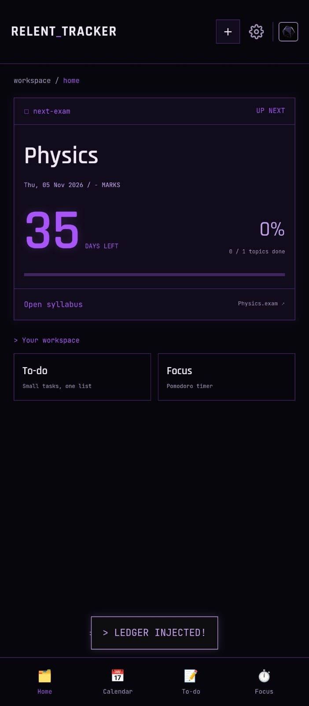
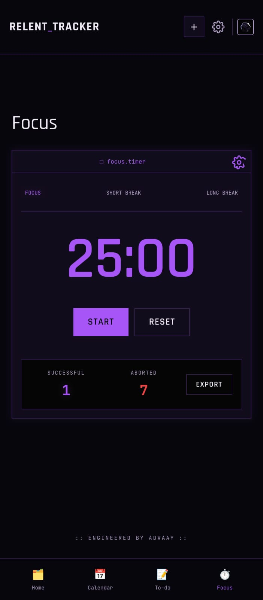
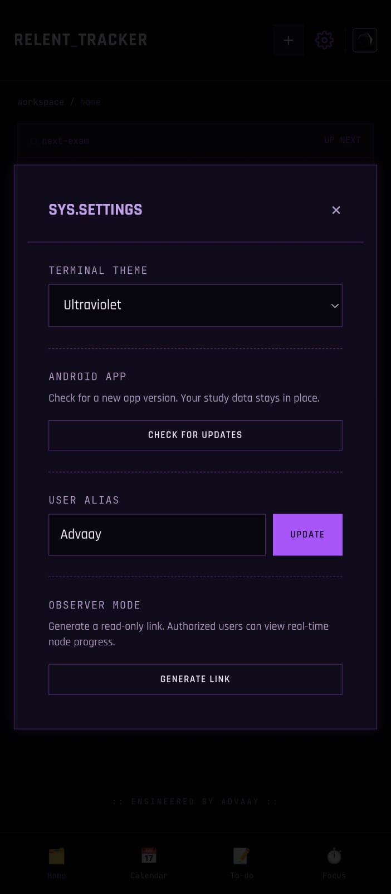
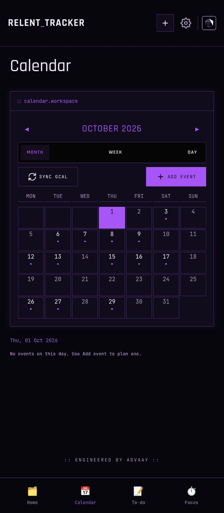
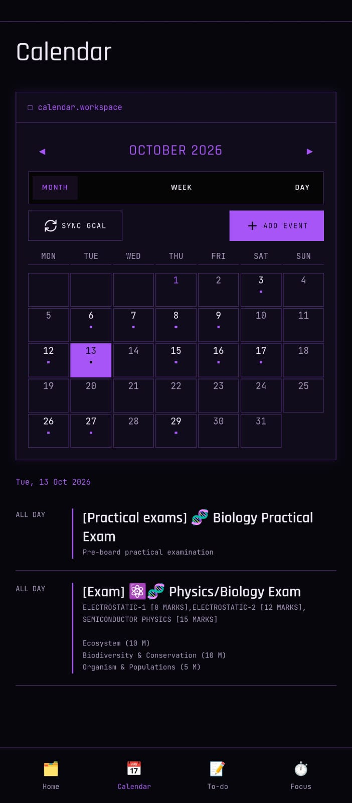
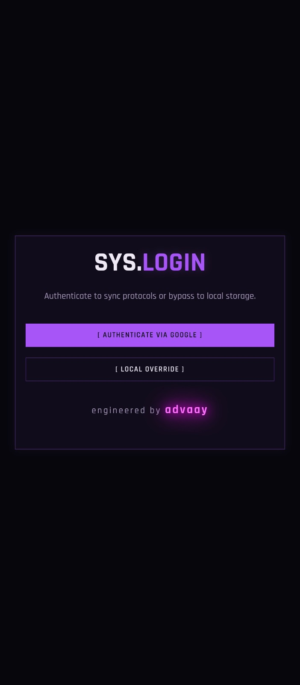

<div align="center">

# 📚 STUDY DASHBOARD

**A personal command center for studying, productivity & everyday chaos.**

<br>

<a href="https://study-dashboard-rose-psi.vercel.app">
  
</a>
<a href="https://github.com/notdropkun/Relent-Tracker/releases">
  
</a>
<a href="https://github.com/notdropkun/Relent-Tracker">
  
</a>


<br><br>

HTML · JavaScript · PWA · Vercel · Android

</div>

## 📲 Get the Android App

Relent Tracker is also a real Android app - a lightweight wrapper around this same dashboard, with home screen widgets.

### Option 1 - Obtainium (recommended, auto-updates)

1. Install **Obtainium** from its [GitHub page](https://github.com/ImranR98/Obtainium) or F-Droid.
2. In Obtainium, tap **Add App** and paste this link:

   ```
   https://github.com/notdropkun/Relent-Tracker
   ```

3. Tap **Add** - Obtainium installs the app and notifies you whenever a new release drops.

### Option 2 - Direct APK

Grab the latest `RTracker` APK from [**Releases**](https://github.com/notdropkun/Relent-Tracker/releases) and open it on your phone.

**Requires Android 7.0 or newer.**

<details>
<summary>🔏 Verify your download (optional)</summary>

Release signing certificate SHA-256 fingerprint:

```
CF:00:EA:AB:E7:AA:7F:F7:CE:9A:FB:3A:EA:D8:74:0D:83:9B:74:8A:D2:39:51:4A:89:B9:06:E4:83:08:67:53
```

Each release also lists the SHA-256 of its APK. You can verify these with AppVerifier or Obtainium.

</details>

## 📸 Screenshots

Real Android app screenshots in the Ultraviolet theme.

| Dashboard | Focus timer | Settings & updates |
| --- | --- | --- |
|  |  |  |

| Calendar month | Calendar events | Login |
| --- | --- | --- |
|  |  |  |


## 🧠 What is this?

Study Dashboard is a personal web app built around one idea:

**Put the useful stuff in one place, make it feel good to use, and keep improving it.**

Instead of building a generic productivity template, this project is treated like a constantly evolving personal workspace - with custom UI, app-style behaviour, PWA support, a native Android app, and a collection of custom audio/voice assets.

It's small enough to experiment with and flexible enough to keep growing.

## ✅ What you can do with it

- 🎯 Track exams with live countdowns
- 📖 Follow your syllabus with per-topic progress
- ✅ Manage tasks & to-dos
- 📅 See your Google Calendar events on the dashboard
- ⏱️ Run focus sessions (Pomodoro) with session counts
- 🎨 Switch between five neon themes (+ hidden ones to find)
- 📱 Pin home screen widgets from the Android app
- ☁️ Sync with Google login, or stay fully offline

## ✨ Highlights

<table>
<tr>
<td width="50%">

### 📖 Study-first

A dashboard designed around the everyday student workflow.

</td>
<td width="50%">

### 📱 App-like

A PWA on the web and a native wrapper on Android, so it behaves like an installed app.

</td>
</tr>
<tr>
<td>

### 🔊 Custom Voice System

Includes a collection of character-inspired voice/audio assets for a more interactive experience.

</td>
<td>

### ⚡ Lightweight

Built primarily with HTML and JavaScript, keeping the project straightforward and easy to iterate on.

</td>
</tr>
</table>

## 🎧 Voice & Audio

One of the fun parts of the project is its custom audio collection.

Current assets include voices inspired by:

**JARVIS · TETO · MIKU · PIKACHU · BEN 10**

These files are part of the dashboard's audio/voice experience.

> Note: The repository contains the audio assets themselves; the exact way each sound is used can evolve as the project changes.

## 📱 Progressive Web App

The project includes the core files needed for a Progressive Web App:

- `manifest.json`
- `sw.js`
- `icon-192.png`
- `icon-512.png`

That gives the project a more app-like foundation and leaves room for offline behaviour, installation, caching, and other PWA improvements.

## 🤖 The Android App

The Android app is a lightweight native wrapper around this same dashboard. This repository holds the website source; Android builds are published on this repo's [Releases](https://github.com/notdropkun/Relent-Tracker/releases) page, so the code and the downloads live in one place.

Log in with the same Google account on the app and the website and your data stays in sync between them.

## 🔐 Your Data

- With Google login, your exams, syllabus progress, tasks, calendar events and focus counts sync between the app and the website.
- Prefer not to log in? Offline mode keeps everything on your device.
- Theme and timer settings live on your device only.
- Observer links share a read-only snapshot with whoever you give the link to.

## 🛠️ Built With

<div align="center">

| Technology | Role |
| --- | --- |
| 🧱 HTML5 | Structure & UI |
| ⚡ JavaScript | Interactions & logic |
| 📱 PWA APIs | Installable / app-like behaviour |
| 🤖 Android | Native wrapper app |
| ▲ Vercel | Deployment |

</div>

## 📂 Repository

```
study-dashboard/
│
├── 🎵 audio / voice assets
├── 🖼️ image & visual assets
├── 📱 PWA icons
├── ⚙️ sw.js
├── 🧾 manifest.json
├── 🌐 index.html
└── 📖 README.md
```

The repository is intentionally simple so new experiments and features can be added without a complicated build setup.

## 🌐 Try It

[↗ Open the live dashboard](https://study-dashboard-rose-psi.vercel.app)

No setup. No build command. Just open it.

## 🗺️ What's Next?

This project is meant to keep evolving.

Possible directions include:

- More study utilities
- Better dashboard customization
- More polished mobile experience
- Expanded voice interactions
- More PWA functionality
- UI/UX improvements
- Additional productivity features

This roadmap is intentionally flexible - this project is also a playground for trying new ideas.

## 🧑‍💻 About the Builder

<div align="center">

**Advaay**

Student · Developer · Tech Enthusiast

*Tech. Old tech. New tech. Gaming. Music. Building random ideas at unreasonable hours.*

</div>

## 📌 Project Status

🟢 **Active**

The dashboard is still being worked on, refined, and experimented with.
Expect the UI, features, and structure to change over time.

## 📄 License

Released under the MIT License - do whatever you want, just keep the copyright notice.

<div align="center">

## ⭐ Like the project?

Give the repository a star if you find it useful or just think it's cool.

<br>

*Made with curiosity, caffeine & too many ideas.*

<br>

© Advaay

</div>
